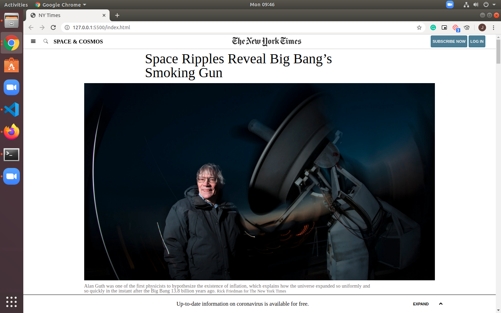

# Positioning_and_Floating_Elements

A clone of the NYT page with fixed footer and navbar to both top and bottom of screen, page includes video inside of article aswell as pictures, there are also aditional ads included below the main article. 

Live link here: https://rawcdn.githack.com/jacobrees/Positioning_and_Floating_Elements/0fa4af5a208b690f7ac9aa59c5cb89dc39081874/index.html

Contributors:

Umair Ahmad
Github: https://github.com/UmairAhmad125

Jacob Rees:
Github: https://github.com/jacobrees
